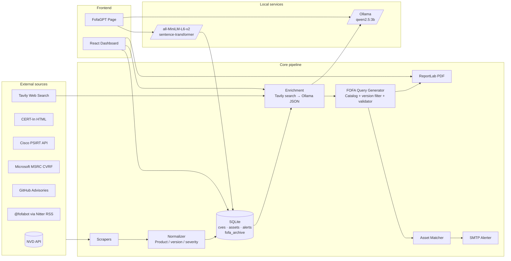
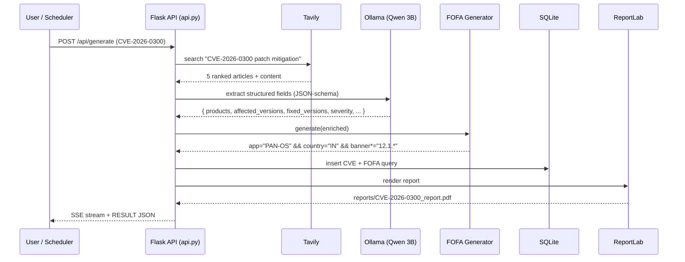
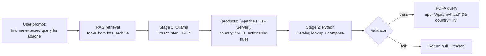

# Attack Surface Monitor

> Automated CVE intelligence and attack-surface monitoring for Indian critical-sector infrastructure (BSNL, ONGC, MTNL, NIC, Power Grid, etc.).
> Built as an internship project under the NTRO / NCIIPC threat-monitoring mandate.

The system pulls vulnerability data from authoritative sources, enriches it with a **local LLM** (no data leaves your machine for the AI step), generates targeted **FOFA reconnaissance queries**, and produces analyst-ready PDF reports — all driven by a polished React dashboard.

---

## Highlights

- **Multi-source scrapers** — NVD, CERT-In, Cisco PSIRT, Microsoft MSRC, GitHub Security Advisories, and a Nitter-RSS-driven `@fofabot` ingester for fresh zero-day intel
- **Local LLM enrichment** — Ollama running Qwen 2.5 3B (Q4_K_M) with JSON-schema constrained output. Air-gapped after the web-search step
- **Agentic web search** — Tavily AI-native search replaces fragile DDG scraping
- **FOFA query generator** — RAG over a verified corpus + curated catalog of `app=` fingerprints + version-narrowing via FOFA's documented `banner*=` operator
- **FofaGPT** — Two-stage natural-language → FOFA query: (1) LLM extracts product intent from messy English, (2) Python composes the query deterministically. No hallucinations.
- **Continuous ingestion** — fofabot tweets get pulled, embedded, and added to the RAG corpus every 3 hours while the API is up
- **Modern UI** — Vite + React 18 + TypeScript + Tailwind, with Server-Sent-Events streaming and live charts (Recharts)

---

## System architecture



---

## Pipeline flow



---

## FofaGPT (natural language → FOFA query)



The two-stage split is what makes this robust against weird grammar. The LLM only has to recognize entities (which 3B nails). Python writes the syntax (which 3B used to hallucinate).

---

## Repository layout

```
attack-surface-monitor/
├── api.py                  # JSON API for the React frontend (recommended)
├── app.py                  # Legacy single-page Flask UI (still works)
├── main.py                 # CLI + 6h/3h scheduler
├── config.py               # API keys + Ollama config
├── requirements.txt
│
├── scrapers/               # Per-source ingesters
│   ├── nvd.py              # NIST NVD CVE 2.0 API
│   ├── certIn.py           # CERT-In advisories + vuln notes
│   ├── cisco.py            # Cisco PSIRT
│   ├── microsoft.py        # MSRC CVRF v2.0
│   ├── github_advisory.py  # GHSA via GraphQL
│   ├── google.py           # Chrome / Android via NVD keyword query
│   ├── agent_search.py     # Tavily web search (replaces DuckDuckGo)
│   └── fofabot_scraper.py  # Nitter-RSS ingester for @fofabot
│
├── core/
│   ├── normalizer.py            # Product alias → canonical key
│   ├── groq_enricher.py         # Ollama call + FOFA query generator (catalog)
│   ├── enrichment_pipeline.py   # Tavily + Ollama orchestration
│   ├── matcher.py               # CVE ↔ asset matching (3-pass)
│   ├── alerter.py               # SMTP alert dispatch
│   ├── report_generator.py      # ReportLab PDF builder
│   ├── fofa_archive.py          # SQLite-backed (NL, query) corpus
│   ├── fofa_rag.py              # sentence-transformers retrieval
│   └── fofa_gpt.py              # Two-stage NL → FOFA pipeline
│
├── asset_discovery/
│   ├── crtsh.py            # Passive subdomain enum via CT logs
│   └── fofa_query.py       # FOFA API client (asset hunt)
│
├── database/
│   └── db.py               # SQLite schema + DAL
│
├── frontend/               # Vite + React 18 + TS + Tailwind
│   ├── src/
│   │   ├── pages/Dashboard.tsx
│   │   ├── pages/Lookup.tsx
│   │   └── pages/FofaGpt.tsx
│   └── package.json
│
├── reports/                # Generated PDFs
├── data/                   # SQLite database file
└── logs/
```

---

## Prerequisites

- **Python 3.11+** ([download](https://www.python.org/downloads/))
- **Node.js 18+** ([download](https://nodejs.org/))
- **Ollama** ([download](https://ollama.com/download)) — local LLM runtime
- **6 GB free RAM** when the LLM is loaded
- A free **Tavily API key** ([signup](https://app.tavily.com))
- A free **NVD API key** ([request](https://nvd.nist.gov/developers/request-an-api-key))

---

## Installation

### 1. Clone and enter the project

```bash
git clone <repo-url>
cd attack-surface-monitor
```

### 2. Create a Python virtual environment

**Windows (PowerShell):**

```powershell
python -m venv .venv
Set-ExecutionPolicy -Scope Process -ExecutionPolicy Bypass
.venv\Scripts\Activate.ps1
```

**Windows (CMD):**

```cmd
python -m venv .venv
.venv\Scripts\activate.bat
```

**Linux / macOS:**

```bash
python3 -m venv .venv
source .venv/bin/activate
```

### 3. Install Python dependencies

```bash
pip install -r requirements.txt
```

### 4. Install and pull the local LLM

```bash
ollama pull qwen2.5:3b
```

The model is ~2 GB. First-time inference downloads it; subsequent calls are local.

### 5. Configure API keys

Edit `config.py` and add your keys:

```python
NVD_API_KEY    = "..."   # From https://nvd.nist.gov/developers/request-an-api-key
TAVILY_API_KEY = "..."   # From https://app.tavily.com

OLLAMA_BASE_URL = "http://localhost:11434"
OLLAMA_MODEL    = "qwen2.5:3b"
OLLAMA_TIMEOUT  = 300
```

### 6. Install frontend dependencies

```bash
cd frontend
npm install
cd ..
```

---

## Running the system

You'll need **two terminals** (three if you want the CLI scheduler too).

### Backend API

**Windows:**
```cmd
.venv\Scripts\activate.bat
python api.py
```

**Linux / macOS:**
```bash
source .venv/bin/activate
python api.py
```

API listens on `http://127.0.0.1:5000`. On startup it pre-warms Ollama and bootstraps the FofaGPT corpus (seeds + PDF reports + fresh fofabot tweets).

### Frontend dev server

```bash
cd frontend
npm run dev
```

Vite dev server runs on `http://127.0.0.1:5173` and proxies `/api/*` to Flask. Open that URL in your browser.

### Optional: CLI scheduler (full pipeline every 6 h)

```bash
# scrape + enrich + alert pipeline once and exit
python main.py --now

# run scheduled forever (every 6 h full + every 3 h fofabot)
python main.py
```

---

## Production build

```bash
cd frontend
npm run build      # outputs to frontend/dist/
```

For deployment, serve `frontend/dist/` from any static host and point it at the running `api.py`. The Vite proxy is dev-only.

---

## Operational notes

- **First Ollama call after restart is slow** (~30–60 s) because the model is loading into RAM. `api.py` pre-warms it on startup, so the first user-visible CVE call is fast.
- **Tavily free tier**: 1000 credits / month. Each CVE enrichment uses 1 credit. Plenty for this scale.
- **Nitter availability**: The fofabot scraper falls back across multiple Nitter instances. If all are down, `_run_ingest_cycle` logs a warning and the rest of the pipeline keeps working — fofabot is one of several intel sources, not a hard dependency.
- **Continuous ingestion runs every 3 hours** while `api.py` is up. To trigger a fresh pull on demand from the UI, click **Refresh corpus** on the FofaGPT page.

---

## Troubleshooting

| Symptom | Likely cause | Fix |
|---|---|---|
| `ModuleNotFoundError: flask` | venv not activated | activate it (see step 2) |
| `[Ollama] Cannot reach …` | Ollama service not running | open Ollama Desktop or run `ollama serve` |
| `Tavily error` on first call | bad / missing API key | check `TAVILY_API_KEY` in `config.py` |
| `request scripts is disabled` (PowerShell) | execution policy blocking `Activate.ps1` | `Set-ExecutionPolicy -Scope Process Bypass` |
| Frontend can't reach API | started before `api.py` was ready | refresh the page once `api.py` logs `Running on http://127.0.0.1:5000` |
| Nitter returns 0 entries | the active instance went down | the scraper auto-fails over; if all 5 are down, wait or add a working instance to `NITTER_INSTANCES` in `scrapers/fofabot_scraper.py` |

---

## Honest limitations

This is an internship-stage prototype. Things a production deployment would harden:

- Secrets are still in `config.py`. Move to environment variables or a secret manager before any deployment.
- No empirical false-positive measurement of FOFA queries against ground truth — that requires manual verification of a sample.
- Long-tail product coverage in the FOFA `app=` catalog (~80 entries today). Grows organically via continuous ingestion but doesn't approach Censys/Shodan internal catalogs.
- Single-machine, single-user. No auth, no rate-limiting, no audit log.

---

## License

Internal project — not for public redistribution.
